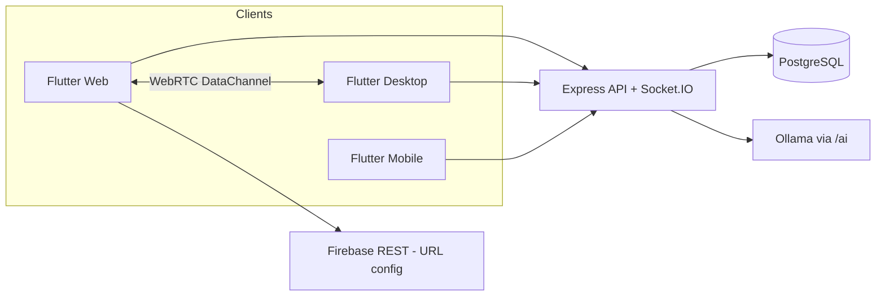

# Architecture — PeerTask Client

Flutter app. Repo này chỉ chứa UI, state, và P2P. Persistence online thuộc [peer_task_server](https://github.com/minhduy6868/peer_task_server).

## 1. Bối cảnh



Hai chế độ:

| Mode | Auth | Room | Dữ liệu bền |
| --- | --- | --- | --- |
| Online | JWT | `boardId` UUID | REST + `board_operations` |
| Offline | không | `roomCode` | Hive local |

Không trộn REST workspace/board vào màn offline.

## 2. Lớp trong `lib/`

```
UI (screens, widgets, theme, l10n)
    ↓ Riverpod
Providers (auth, workspace, board, task, peer, language, offline)
    ↓
Services
    ApiService          REST, refresh token
    SignalingService    Socket.IO
    WebRTC / P2pManager DataChannel
    StorageService      Hive
    ConfigService       URL backend / Ollama
    AiService           brainstorm
    ↓
SyncEngine              apply op, dedup opId, LWW
```

Quy tắc: widget không `http` trực tiếp; không `new ApiService()` trong `build`.

## 3. Boot và routing

`main.dart`:

1. `Firebase.initializeApp`
2. `StorageService.init()` + `ConfigService.init()`
3. `ProviderScope` override storage/config
4. `GoRouter` + `authStateProvider`

Redirect:

- Đã login + `/login` hoặc `/` → last workspace hoặc `/workspaces`
- Public: `/login`, `/forgot-password`, `/reset-password`, `/offline-*`
- Còn lại: bắt JWT

## 4. Config URL

Thứ tự trong `ConfigService`:

1. Hive override (user)
2. Firebase RTDB REST (`peer-task-be-url`, `peer-task-ollama-url`)
3. `assets/config.json`
4. `http://localhost:3000`

Lỗi socket/timeout: `handleApiError()` rồi retry. Header `ngrok-skip-browser-warning: true` luôn gửi kèm.

## 5. Auth trên client

- Login/register lưu `accessToken`, `refreshToken`, user JSON vào Hive.
- `Authorization: Bearer`.
- HTTP 401 → `POST /token/refresh` `{ refreshToken }` một lần, rồi `clearTokens` nếu fail.
- Không có prefix `/api`.

## 6. Đồng bộ board (online)

```mermaid
sequenceDiagram
  participant UI as BoardScreen
  participant SE as SyncEngine
  participant DC as DataChannel
  participant API as REST
  UI->>SE: createOperation(type, payload)
  SE->>UI: apply local
  SE->>DC: broadcast Operation JSON
  SE->>API: POST /operations (nếu shouldSaveBackend)
  DC->>SE: receiveOperation (peer)
  Note over SE: skip nếu opId đã có; LWW theo timestamp
  UI->>API: GET /operations/board/:id?since=
```

`OperationType`: `createObject` | `updateObject` | `deleteObject` | `moveObject` | `resizeObject`.

Payload canvas thường có `type`: `stroke` | `text` | `rectangle` | `circle` | `line` | `cursor` | `task`.

Không đưa vào map `_objects`: stroke/text/shape/cursor/task — UI đọc op log. Cursor: `shouldSaveBackend: false`.

Task metadata (assignee, deadline, status) ưu tiên REST `/tasks`. Op `type: task` chỉ để hiện trên canvas.

## 7. Signaling / WebRTC

- Connect Socket.IO với `auth.token` = access JWT.
- Online emit `join_room` **string** `boardId` (không wrap object).
- Nghe `room_joined`, `peer_joined`, `peer_left`, `signal`, `peer_mic_updated`.
- SDP/ICE qua `signal` `{ to, signal }`.
- Offline: không token; `create_room` / `join_room` `{ roomCode, userName }`.

File: `signaling_service.dart`, `webrtc_service.dart`, `services/p2p/`.

## 8. UI

- Material 3, `AppTheme.lightTheme`, primary `#4A90E2`.
- Shared: `AppButton`, `AppDialog`, `AppToast`, `AppCard`.
- `BoardScreen`: canvas (pen / eraser / text) + panel Kanban.
- Mọi chuỗi user-facing: `AppLocalizations` + cả `app_en.arb` và `app_vi.arb`.

## 9. Models

Freezed. API trả `snake_case`. `User`, `Workspace`, `Board` có `fromJson` nhận cả `created_at` và `createdAt`.

Sau khi đổi annotation: `dart run build_runner build --delete-conflicting-outputs`. Không sửa tay `*.freezed.dart` / `*.g.dart`.

## 10. Quyết định đã chốt

| Quyết định | Lý do |
| --- | --- |
| P2P cho nét vẽ, REST cho task/membership | Giảm tải server, quyền vẫn ở API |
| Operation log trên server | Người join muộn catch-up |
| Offline tách room + Hive | Làm việc LAN không cần tài khoản |
| Config URL động | Đổi ngrok/host không ship app mới |
